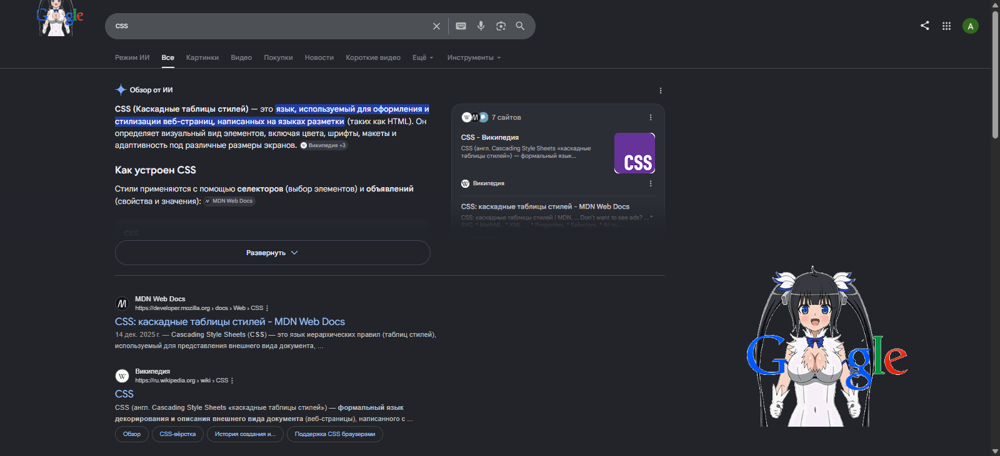
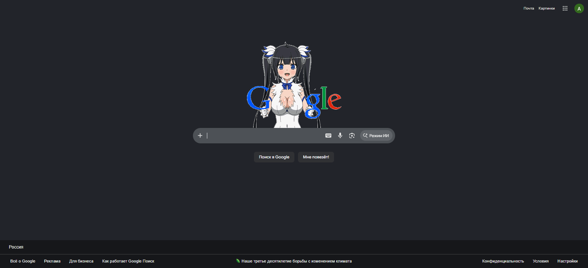

# Hestia-Google-Logos-2026-Rework-

Rework of Hestia Google Logos for Chrome 2026. No ownership claimed. 
Original by **BiggestHestiaFan**: [userstyles.org/styles/273752/hestia-google-logos](https://userstyles.org)

---

## 🚀 How to Install and Run This CSS Style

To apply this custom CSS style to Google in your browser, follow these simple steps:

### Step 1. Install a Custom Styles Extension
You need a browser extension that allows you to inject custom CSS styles into web pages.
1. Open your browser's extension store (Chrome Web Store, Edge Add-ons, Opera Add-ons, etc.).
2. Search for and install one of these popular extensions:
   * **Stylus** (highly recommended — lightweight, open-source, and ad-free).
   * Or **Stylish**.

### Step 2. Create a New Style
1. Click on the **Stylus** (or Stylish) extension icon in your browser's toolbar.
2. Click on **"Manage"** or **"Write style for"**.
3. If you see the option, select **"write style for: google.com"** (or manually specify the target URL inside the extension editor so the style only runs on Google pages).

### Step 3. Add the CSS Code
1. Copy all the code from your project's `.css` file.
2. Paste the copied code into the main text area of the extension's editor.
3. In the left sidebar of the editor, enter a name for the style (e.g., `Hestia Google Logos 2026`).
4. Click the **"Save"** button in the top-left corner.

### Step 4. Verify the Changes
Open or refresh the [google.com](https://google.com) homepage. The new logos and styling should now be active!

